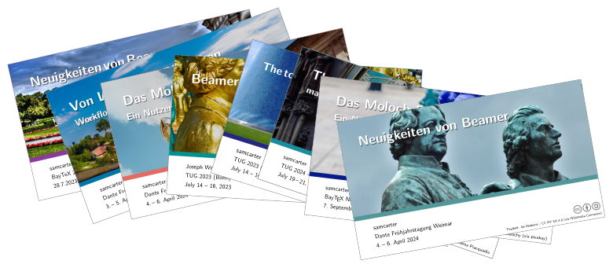

# Contact

You can find me on Mastodon: [@samcarter@fosstodon.org](https://fosstodon.org/@samcarter)

I'm also active on several Q&A sites, e.g.:

- [TopAnswers TeX](https://topanswers.xyz/tex)
- [TeXnique.fr](https://texnique.fr/osqa/)
- [Codidact Power Users](https://powerusers.codidact.com/categories/61)

# TeX Packages

- TikZducks (
    [CTAN](https://www.ctan.org/pkg/tikzducks), 
    [github](https://github.com/samcarter/tikzducks)
  )
- TikZlings (
    [CTAN](https://www.ctan.org/pkg/tikzlings), 
    [github](https://github.com/samcarter/tikzlings)
  )
- TikZbricks (
    [CTAN](https://www.ctan.org/pkg/tikzbricks), 
    [github](https://github.com/samcarter/TikZbricks)
  )
- TikZmarmots (
    [CTAN](https://www.ctan.org/pkg/tikzmarmots), 
    [github](https://github.com/samcarter/TikZmarmots)
  )
- Jigsaw (
    [CTAN](https://www.ctan.org/pkg/jigsaw), 
    [github](https://github.com/samcarter/jigsaw)
  )
- Tcolorbox (x)beamer inner theme (
    [CTAN](https://www.ctan.org/pkg/beamertheme-tcolorbox), 
    [github](https://github.com/samcarter/beamertheme-tcolorbox)
  )
- Rainbow beamer colour theme (
    [CTAN](https://www.ctan.org/pkg/beamertheme-rainbow), 
    [github](https://github.com/samcarter/beamertheme-rainbow)
  )
- Spectrum (x)beamer theme (
    [CTAN](https://www.ctan.org/pkg/beamertheme-spectrum), 
    [github](https://github.com/samcarter/beamertheme-spectrum)
  )  
- pgfplotsthemebeamer (
    [CTAN](https://ctan.org/pkg/pgfplotsthemebeamer), 
    [github](https://github.com/samcarter/pgfplotsthemebeamer)
  )
- cistercian (
    [CTAN](https://ctan.org/pkg/cistercian), 
    [github](https://github.com/samcarter/cistercian)
  )  

Furthermore, I'm one of the maintainers for the LaTeX beamer class ([CTAN](https://www.ctan.org/pkg/beamer), [github](https://github.com/josephwright/beamer)).

# TeX Talks

- **Dante Frühjahrstagung 2025 - Darmstadt**
  - Von LaTeX zum Plätzchen – Ein Workflow zum Erstellen einfacher 3D Dateien (
      [📄abstract](https://www.dante.de/veranstaltungen/dante2025/programm/vortraege/#samcarter-3d),
      [🖼︠slides](https://github.com/samcarter/samcarter/raw/main/ressouces/Dante2025_Cookies.pdf),
      [🬠video](https://www.youtube.com/watch?v=_ZiabtV5Od0)
    )
- **BayTeX 2024 - Neu-Ulm**
  - Das Moloch Beamer Theme - Ein Nutzerbericht (
      [🖼︠slides](https://github.com/samcarter/samcarter/raw/main/ressouces/BayTeX2024_Moloch.pdf)
    )
- **TUG Annual Meeting 2024 - Prague**
  - The moloch beamer theme (
      [📄abstract](https://tug.org/tug2024/abstracts/samcarter-moloch.txt),
      [🖼︠slides](https://github.com/samcarter/samcarter/raw/main/ressouces/TUG2024_Moloch.pdf),
      [🬠video](https://www.youtube.com/watch?v=Pb6NsBWiuro)
    )
- **Dante Frühjahrstagung 2024 - Weimar**
  - Neuigkeiten von Beamer (
      [📄abstact](https://www.dante.de/veranstaltungen/dante2024/programm/vortraege/#samcarter-neuigkeiten),
      [🖼︠slides](https://github.com/samcarter/samcarter/raw/main/ressouces/Dante2024_BeamerNews.pdf)
    )
  - Das Moloch Beamer Theme - Ein Nutzerbericht (
      [📄abstract](https://www.dante.de/veranstaltungen/dante2024/programm/vortraege/#samcarter-beamer),
      [🖼︠slides](https://github.com/samcarter/samcarter/raw/main/ressouces/Dante2024_Moloch.pdf)
    )
- **BayTeX 2023 - Kirchheim**
  - Neuigkeiten von Beamer (
      [🖼︠slides](https://github.com/samcarter/samcarter/raw/main/ressouces/BayTeX2023_BeamerNews.pdf)
    )
- **TUG Annual Meeting 2023 - Bonn**
  - The tcolorbox inner beamer theme (
      [📄abstract](https://tug.org/tug2023/abstracts/samcarter-beamertcolorbox.txt), 
      [🖼︠slides](https://github.com/samcarter/samcarter/raw/main/ressouces/TUG2023_Tcolorbox.pdf),
      [🬠video](https://www.youtube.com/watch?v=M0qWEutAPYg)
    )
  - Behind the scenes of the Great TikZlings Christmas Extravaganza (
      with Ulrike & Gert Fischer, Carla Maggi and Paulo Cereda, 
      [📄abstract](https://tug.org/tug2023/abstracts/fischer-tikzlings.txt), 
      [🖼︠slides](https://github.com/samcarter/samcarter/raw/main/ressouces/TUG2023_Extravaganza.pdf),
      [🬠video](https://www.youtube.com/watch?v=ti2wNT6HxZo)
    )
  - Beamer news (
      with Joseph Wright, 
      [📄abstract](https://tug.org/tug2023/abstracts/wright-beamernews.txt), 
      [🖼︠slides](https://github.com/samcarter/samcarter/raw/main/ressouces/TUG2023_BeamerNews.pdf)
    )
- **Dante Herbsttagung 2022 - virtual**
  - Das Tcolorbox Inner Theme für Beamer (
      [📄abstract](https://www.dante.de/veranstaltungen/herbst-2022/programm/vortraege/#samcarter2),
      [🖼︠slides](https://github.com/samcarter/samcarter/raw/main/ressouces/Dante2022_Tcolorbox_Theme.pdf),
      [🬠video](https://vimeo.com/773291199)
    )
  - Das TikZbricks Paket (
      [📄abstract](https://www.dante.de/veranstaltungen/herbst-2022/programm/vortraege/#samcarter3),
      [🖼︠slides](https://github.com/samcarter/samcarter/raw/main/ressouces/Dante2022_TikZbricks.pdf),
      [🬠video](https://vimeo.com/773291903)
    )
  - Das Jigsaw Paket (
      [📄abstract](https://www.dante.de/veranstaltungen/herbst-2022/programm/vortraege/#samcarter1),
      [🖼︠slides](https://github.com/samcarter/samcarter/raw/main/ressouces/Dante2022_Jigsaw.pdf),
      [🬠video](https://vimeo.com/773292029), 
    )
- **TUG Annual Meeting 2022 - virtual**
  - The TikZbricks package (
      [🖼︠slides](https://github.com/samcarter/samcarter/raw/main/ressouces/TUG2022_TikZbricks.pdf),
      [🬠video](https://vimeo.com/773294015)
    )
  - The jigsaw package (
      [🖼︠slides](https://github.com/samcarter/samcarter/raw/main/ressouces/TUG2022_Jigsaw.pdf),
      [🬠video](https://vimeo.com/773294117)
    )
- **Dante Frühjahrstagung 2022 - Magdeburg**
  - Das Sillypage Paket (
      [🖼︠slides](https://github.com/samcarter/samcarter/raw/main/ressouces/Dante2022_Sillypage.pdf),
      [🬠video](https://vimeo.com/773292271) 
    )
- **TUG Annual Meeting 2021 - virtual**
  - News from the TikZ zoo (
      [🖼︠slides](https://github.com/samcarter/samcarter/raw/main/ressouces/TUG2021_TikZzoo.pdf),
      [🬠video](https://vimeo.com/773293865) 
    )
- **Journée GUTenberg 2021 - virtual**
  - Une courte introduction aux extensions TikZducks et TikZlings (
      [🖼︠slides](https://github.com/samcarter/samcarter/raw/main/ressouces/GUTenberg2021_TikZducks_et_TikZlings.pdf),
      [🬠video](https://vimeo.com/773296726)
    )
- **Dante Frühjahrstagung 2021 - virtual**
  - Neuigkeiten aus dem TikZ Zoo (
      [🖼︠slides](https://github.com/samcarter/samcarter/raw/main/ressouces/Dante2021_TikZzoo.pdf),
      [🬠video](https://vimeo.com/773292978)
    )
  - TopTeX - eine Q&A Seite für TeX (
      [🖼︠slides](https://github.com/samcarter/samcarter/raw/main/ressouces/Dante2021_TopTeX.pdf),
      [🬠video](https://vimeo.com/773293022)
    )
- **TUG Annual Meeting 2020 - virtual**
  - TopTeX - a new Q&A site for TeX (
      [🖼︠slides](https://github.com/samcarter/samcarter/raw/main/ressouces/TUG2020_TopTeX.pdf),
      [🬠video](https://vimeo.com/773293592)
    )
- **TUG Annual Meeting 2018 - Rio de Janeiro**
  - A short introduction to the TikZducks package (
      with Paulo Cereda, 
      [🖼︠slides](https://github.com/samcarter/samcarter/raw/main/ressouces/TUG2018_TikZducks.pdf),
      [🬠video](https://www.youtube.com/watch?v=Ps2FK0q6mLc)
    )
- **Dante Frühjahrstagung 2018 - Passau**
  - TikZducks (
      [🖼︠slides](https://github.com/samcarter/samcarter/raw/main/ressouces/Dante2018_TikZducks.pdf)
    )

# TeX Publications

- samcarter & Ulrike Fischer (2025): "Cookie cutters: An example workflow of how to generate simple 3D-printable objects from LaTeX graphics", TUGboat 46.1 (
    [doi](https://doi.org/10.47397/tb/46-1/tb142samcarter-cookies),
    [url](https://tug.org/TUGboat/tb46-1/)
  )
  
- samcarter & Ulrike Fischer (2025): "Von LaTeX zum Plätzchen", submitted to Die TEXnische Komödie
- samcarter (2023): "Book review: LaTeX Graphics with TikZ by Stefan Kottwitz", TUGboat 44.3 (
    [doi](https://doi.org/10.47397/tb/44-3/tb138reviews-kottwitz-tikz),
    [url](https://tug.org/TUGboat/tb44-3/)
  )

- samcarter & Joseph Wright (2023): "Beamer news: 2023", TUGboat 44.2 (
    [doi](https://doi.org/10.47397/tb/44-2/tb137samcarter-beamernews23), 
    [url](https://tug.org/TUGboat/tb44-2/)
  ) 

- samcarter & Gert Fischer (2023): "Behind the scenes of the Great TikZlings Christmas Extravaganza", TUGboat 44.2 (
    [doi](https://doi.org/10.47397/tb/44-2/tb137samcarter-tikzlings), 
    [url](https://tug.org/TUGboat/tb44-2/)
  ) 

- samcarter (2021): "The TikZlings package", TUGboat 42.2 (
    [doi](https://doi.org/10.47397/tb/42-2/tb131samcarter-tikzlings), 
    [url](https://tug.org/TUGboat/tb42-2/)
  )
